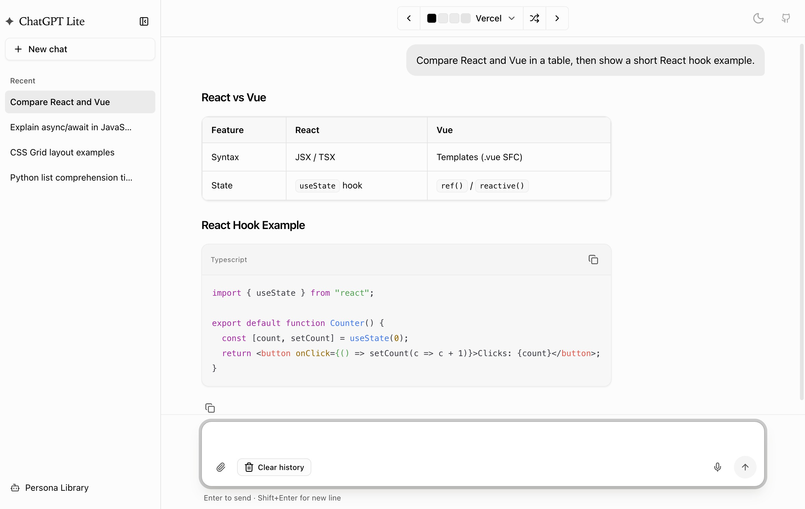
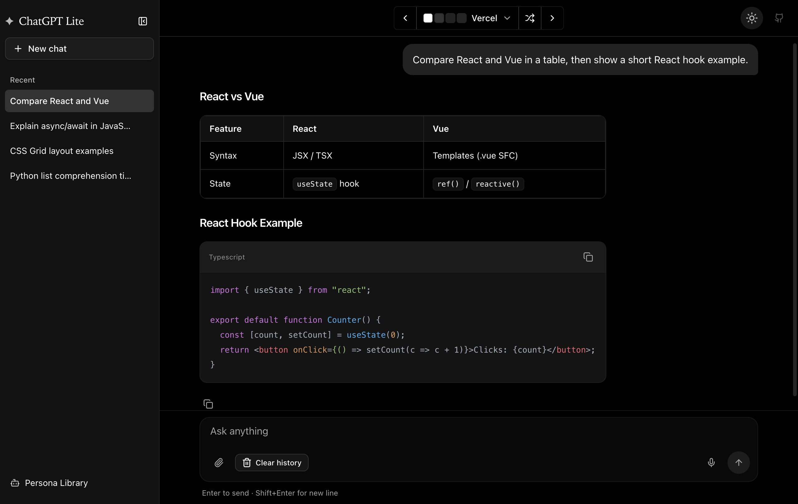

# ChatGPT Lite

English | [简体中文](./README.zh-CN.md)

ChatGPT Lite is a feature-rich, self-hostable ChatGPT app with a Next.js frontend and a FastAPI RAG backend.

## Demo

Try the [ChatGPT Lite Demo Site](https://gptlite.vercel.app).

| Light Theme | Dark Theme |
|:-----------:|:----------:|
|  |  |

| Folder Chat | Notes |
|:-----------:|:-----:|
|  |  |


## Features

- **Real-time streaming responses** - Token streaming from backend to UI with SSE
- **Unified LangGraph orchestration** - Simple chat, RAG, and tool routes in one graph
- **Intent routing** - Classifies requests into `chat`, `rag_doc`, or `tool:*`
- **Folder knowledge base** - Create folders, upload files, and chat per folder
- **Sidebar chat UX** - Chat grouping, folder actions, and route-based chat selection
- **Chat URL routing** - `/chat` main view and `/chat/[chatId]` for direct chat links
- **Voice input and transcription** - Web voice input plus backend WhisperX endpoint
- **Rich markdown rendering** - Markdown + code highlighting support
- **Persistent chat history** - Local state-based multi-conversation management
- **Supports OpenAI/Azure/OpenAI-compatible frontend providers + local Ollama backend**

This project is built on top of [ChatGPT Minimal](https://github.com/blrchen/chatgpt-minimal), extending it with themes, personas, file attachments, voice input, and more.

## Development

### Run locally (without Docker)

#### 1) Frontend setup

From project root:

```bash
npm install
cp .env.example .env.local
```

Start frontend:

```bash
npm run dev
```

Frontend runs on `http://localhost:3000`.

#### 2) Backend setup

From `backend` directory:

```bash
pip install -r requirements.txt
cp .env.example .env
uvicorn app.main:app --reload --host 0.0.0.0 --port 8000
```

Backend runs on `http://127.0.0.1:8000`.

#### 3) Prerequisites for local RAG

- Install and run [Ollama](https://ollama.com/) locally.
- Ensure your configured Ollama model is available (default: `llama3.1:8b`).

## Current API Endpoints (Backend)

- `GET /api/v1/health`
- `POST /api/v1/chat`
- `POST /api/v1/chat/stream`
- `POST /api/v1/upload`
- `GET /api/v1/documents`
- `GET /api/v1/documents/{document_id}`
- `DELETE /api/v1/documents/{document_id}`
- `POST /api/v1/folders`
- `GET /api/v1/folders`
- `DELETE /api/v1/folders/{folder_id}`
- `POST /api/v1/folders/{folder_id}/chat`
- `POST /api/v1/transcribe`
- Notes APIs under `/api/v1/notes`

## Current Frontend Routes

- `/chat` - Main chat screen
- `/chat/[chatId]` - Direct route to a specific chat
- `/chat/folder/[folderId]` - Folder chat workspace
- `/workspace` - Workspace landing page
- `/notes` - Notes list

## Environment Variables

### Frontend (`.env.local`)

| Name | Description | Default |
| --- | --- | --- |
| OPENAI_API_KEY | OpenAI API key |  |
| OPENAI_API_BASE_URL | OpenAI-compatible base URL | `https://api.openai.com` |
| OPENAI_MODEL | Default frontend model | `gpt-4o-mini` |
| AZURE_OPENAI_RESOURCE_NAME | Azure resource name |  |
| AZURE_OPENAI_API_KEY | Azure API key |  |
| AZURE_OPENAI_DEPLOYMENT | Azure deployment name |  |
| RAG_BACKEND_URL | FastAPI backend base URL | `http://127.0.0.1:8000` |

### Backend (`backend/.env`)

| Name | Description | Default |
| --- | --- | --- |
| OLLAMA_BASE_URL | Ollama base URL | `http://127.0.0.1:11434` |
| OLLAMA_CHAT_MODEL | Ollama chat model | `llama3.1:8b` |
| EMBEDDING_MODEL | Sentence-transformers embedding model | `all-MiniLM-L6-v2` |
| WHISPERX_MODEL | WhisperX model size/name | `small` |
| WHISPERX_DEVICE | WhisperX runtime device | `cpu` |
| WHISPERX_COMPUTE_TYPE | WhisperX compute type | `int8` |
| WHISPERX_LANGUAGE | Optional fixed language code |  |
| UPLOAD_DIR | Upload storage folder | `storage/uploads` |
| MAX_FILE_MB | Max upload size in MB | `20` |
| CHROMA_PERSIST_DIR | ChromaDB persistence folder | `storage/chromadb` |
| HOST | Backend bind host | `0.0.0.0` |
| PORT | Backend bind port | `8000` |

## Acknowledgments

- Theme code from [tweakcn](https://github.com/jnsahaj/tweakcn)

## Contribution

PRs of all sizes are welcome.
